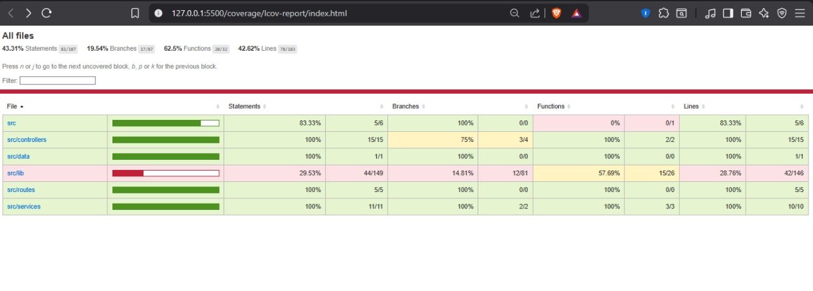

# Net Run Rate Scenario Planner

A full-stack web application for simulating cricket match scenarios to determine if a team can reach a desired position in the points table based on Net Run Rate (NRR) calculations.

## Features

- **Interactive Scenario Planning**: Input match parameters and simulate outcomes
- **Real-time Calculations**: Compute required runs and NRR adjustments
- **Points Table Visualization**: View current standings with team statistics
- **Responsive Design**: Modern UI built with Tailwind CSS
- **Comprehensive Testing**: Full test coverage for both frontend and backend

## Tech Stack

### Frontend
- **Next.js 16** - React framework
- **React 19** - UI library
- **Tailwind CSS 4** - Styling framework
- **Jest** - Testing framework
- **Testing Library** - Component testing utilities

### Backend
- **Express.js 5** - Web framework
- **Node.js** - Runtime environment
- **Zod** - Schema validation
- **CORS** - Cross-origin resource sharing
- **Jest** - Testing framework
- **Supertest** - API testing utilities

## Project Structure

```
assignment/
├── frontend/          # Next.js application
│   ├── app/          # Next.js app directory
│   │   ├── page.jsx  # Main application page
│   │   ├── layout.jsx # Root layout
│   │   └── globals.css # Global styles
│   ├── lib/          # Utility functions
│   │   ├── format.js # Formatting utilities
│   │   └── __tests__/ # Unit tests
│   ├── public/       # Static assets
│   └── package.json  # Frontend dependencies
├── backend/          # Express.js API server
│   ├── src/
│   │   ├── app.js   # Express app setup
│   │   ├── index.js # Server entry point
│   │   ├── controllers/ # Route handlers
│   │   ├── services/    # Business logic
│   │   ├── lib/         # Utility libraries
│   │   ├── routes/      # API routes
│   │   ├── data/        # Static data
|   |   ├── screenshots/ # Images (report)   
│   │   └── tests/       # Test files
│   └── package.json # Backend dependencies
└── README.md        # This file
```

## Getting Started

### Prerequisites

- Node.js (v18 or higher)
- npm or yarn

### Installation

1. **Clone the repository**
   ```bash
   git clone <repository-url>
   cd assignment
   ```

2. **Install backend dependencies**
   ```bash
   cd backend
   npm install
   ```

3. **Install frontend dependencies**
   ```bash
   cd ../frontend
   npm install
   ```

### Running the Application

1. **Start the backend server**
   ```bash
   cd backend
   npm run dev
   ```
   The backend will run on `http://localhost:4000`

2. **Start the frontend application**
   ```bash
   cd frontend
   npm run dev
   ```
   The frontend will run on `http://localhost:3000`

3. **Open your browser** and navigate to `http://localhost:3000`

## Usage

1. **Select Your Team**: Choose from the current points table
2. **Choose Opposition**: Select the opposing team
3. **Set Match Parameters**:
   - Match overs (default: 20)
   - Desired table position
   - Toss result (Batting First or Bowling First)
   - Runs scored (if batting first) or runs to chase (if bowling first)
4. **Compute Scenario**: Click the button to calculate the required performance
5. **Review Results**: See the runs needed and NRR impact

## API Endpoints

### GET /api/teams
Returns the current points table data.

**Response:**
```json
{
  "teams": [
    {
      "team": "Team Name",
      "matches": 10,
      "won": 6,
      "lost": 4,
      "points": 12,
      "nrr": 0.234
    }
  ]
}
```

### POST /api/scenario
Computes the scenario based on input parameters.

**Request Body:**
```json
{
  "yourTeam": "Team A",
  "opponentTeam": "Team B",
  "totalOvers": 20,
  "desiredPosition": 3,
  "toss": "batting-first",
  "runs": 150
}
```

**Response:**
```json
{
  "scenarioType": "batting-first",
  "restrictionRange": {
    "minRuns": 120,
    "maxRuns": 140,
    "overs": 20,
    "nrrRange": {
      "min": -0.5,
      "max": 0.3
    }
  }
}
```

## Testing

### Frontend Tests
```bash
cd frontend
npm test
```

### Backend Tests
```bash
cd backend
npm test
```

Both frontend and backend tests generate HTML coverage reports that can be viewed in your browser. After running tests, open the generated `coverage/lcov-report/index.html` file in your browser to see detailed coverage reports.




## Development

### Code Quality
- ESLint for code linting
- Prettier for code formatting (recommended)
- Jest for unit and integration testing

### Environment Variables

**Frontend (.env.local):**
```
NEXT_PUBLIC_BACKEND_URL=http://localhost:4000/api
```

**Backend (.env.local):**
```
PORT=4000
```
